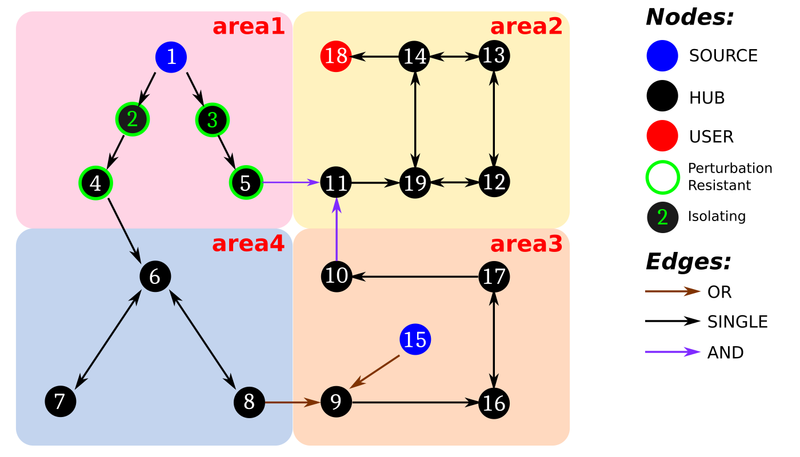

# Input description

The input for the graph construction currently 
consists of text files reflecting the hierarchy of
the plant elements and their features.
In the text input files each line corresponds 
to a node/element description. 
The same line reports the name of the predecessor 
of a particular node/element, 
the relationship between them, and the list of 
node’s attributes (area in which the element is 
present, perturbation resistance, etc.).
In this way each line corresponds to an edge
connecting a element to its parent element.

Each line should contain the following info:
- element id (**Mark**)
- parent of the element id (**father_mark**)
- parent-child relationship 
(**father_cond**: *AND*, *OR*, *SINGLE*, *ORPHAN*. It is an edge attribute.)
- type of element 
(**Description**: *isolation_A*, *isolation_B* are isolating elements 
with opposite behaviour. It is a node attribute.)
- state of the isolating element 
(**InitStatus**: *1*, *0*. It is a node attribute.)
- area in which the element is located 
(**Area**. It is a node attribute.)
- element external perturbation resistance 
(**PerturbationResistant**: *1*, *0*. It is a node attribute.)
- source - hub - user elements 
(**Type**: *SOURCE* or *HUB* or *USER*. It is a node attribute.)

The hierarchy of the elements explains how commodities
flow from one element to another element
and from one system to another system. 
In fact, if the input is properly formatted, with this
simple digraph model it is possible to represent and 
integrate different interconnected plants
in a unique graph without losing information about 
their peculiarities. 

In the graph, the nodes represent the system elements 
while the edges connecting the nodes harbor the logic 
relations (edge attributes) existing between the elements 
(*ORPHAN*, *SINGLE*, *AND*, and *OR*).
- An **ORPHAN** edge is the edge of a node without predecessors.
- A **SINGLE** edge connects a node to its only one predecessor.
- An **AND** edge indicates that the node/element 
has more than one predecessor. All the predecessors are 
necessary for the functioning of that element.
- An **OR** edge indicates that the node/element has 
more than one predecessor. Just one of the node’s 
predecessors should be active to guarantee the functioning 
of the element.
For this reason, correct input formatting 
is one of the most important steps of the analysis.

## Example

In the cartoon is represented the example input file `TOY_graph.csv `.
In this file are present 19 nodes/elements connected by
direct edges that reflect the hierarchy of the system 
in a parent-child fashion.

The nodes are disributed in adjacent areas.

In area1 are present 5 nodes: 1, 2, 3, 4 and 5.

In area2 are present nodes: 11, 19, 12, 13, 14 and 18.

In area3 are present nodes: 15, 9, 16, 17 and 10.

In area4 are present nodes: 6, 7 and 8.

A perturbation of one or multiple elements in one area
may exceed the area boundaries and propagate
to other systems connected to it, located in other
areas. 

Nodes 2, 3, 4, 5 are perturbation resistant nodes 
("PerturbationResistant" field = "1").
These nodes will not be affected by the simulated
perturbation.

Nodes 2 and 3 are isolating elements ("Description field" =
"isolation_A"). In the figure, perturbing node 1 would result 
in the breakage of all the nodes present in the graph except 
node 15 in absence of isolating elements. On the other hand, 
isolating elements 2 and 3 would stop the perturbation propagation
cascade to node 1.

### Simulate a perturbation in area 'area1' 

1. In file `general_graph.py`:

* Uncomment  `g.simulate_multi_area_perturbation(['area1']) `.

* Uncomment  `g.check_input_with_gephi() `.

2. Run:

 `python general_graph.py TOY_graph.csv `

# Output description:

### area_perturbation.csv

In this table is listed the new status of the elements 
(active, not-active) and the areas in which the elements 
are located (affected, not affected) as well as the new status
of elements that have been operated to stop the 
propagation of the perturbation or to open new paths
in case of unavailabilty of the default ones. 
The efficiency (*nodal efficiency*, *local efficiency*, *global efficiency*)
and closeness indices (*closeness_centrality*, *betweenness_centrality*, 
*indegree_centrality*) are then recalculated.

### service_paths_multi_area_perturbation.csv

In this table are reported the paths (all paths and shortest paths), if any, 
that connect source and target elements.
Paths are calculated before and after perturbing one or multiple elements.

### general_code_output.log

Logging debug output.
### check_import_nodes.csv

List of nodes to visualize the input with Gephi.

### check_import_edges.csv

List of edges to visualize the input with Gephi.
